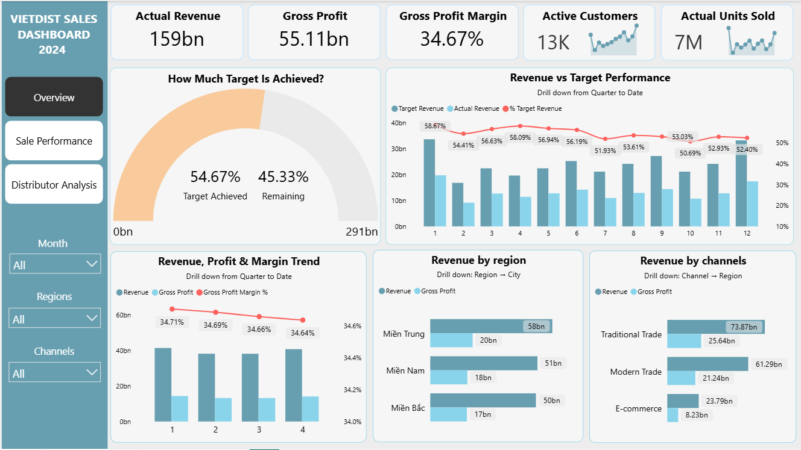
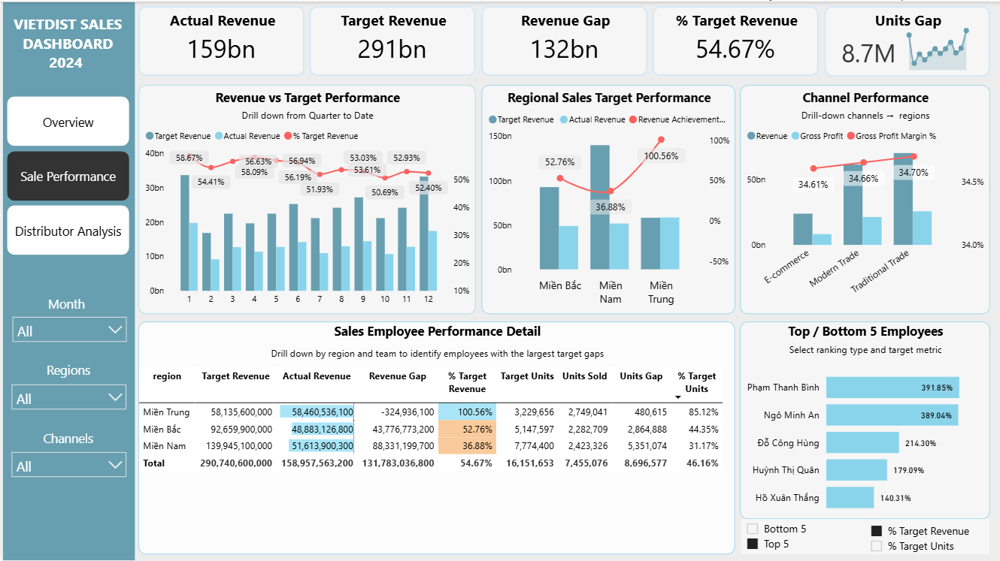
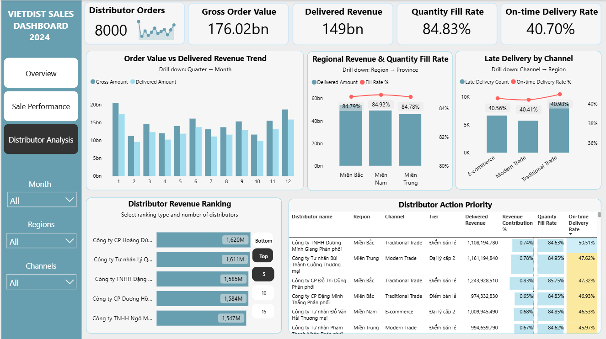

# VietDist Analytics Project — End-to-End Summary

## 1. Project Purpose

VietDist Analytics is an end-to-end sales and distribution analytics project.

The goal is to transform raw Excel/CSV operational data into a structured analytics platform that supports business reporting and management decision-making in Power BI.

This project demonstrates the full analytics engineering workflow:

```text
Raw files → Python ingestion → PostgreSQL → dbt Silver → dbt Gold → Power BI → Insights & Recommendations
```

---

## 2. Architecture Overview

The project follows a Medallion Architecture.

| Layer | PostgreSQL Schema | Main Purpose | Tools |
|---|---|---|---|
| Bronze | `raw` | Store raw data with ingestion metadata | Python, SQLAlchemy, PostgreSQL |
| Silver | `silver` | Clean, standardize, type-cast, deduplicate, validate | dbt, PostgreSQL |
| Gold | `gold` | Build dimensions, facts, and marts for analytics | dbt, PostgreSQL |
| Serving | Power BI | Dashboard, insights, recommendations | Power BI |

The original project brief supports Google Drive and OneDrive ingestion. For this portfolio version, local sample files are used for reproducibility, while the ingestion structure remains modular for future cloud-source automation.

---

## 3. Data Sources

The project ingests 10 source files covering sales, customers, products, distributors, employees, territory mapping, returns, promotions, and sales targets.

| Source | Raw Table | Rows Loaded |
|---|---|---:|
| Sales Transactions | `raw.sales_transactions` | 119,101 |
| Sales Target Plan | `raw.sales_targets_raw` | 1,950 |
| Customer Master | `raw.customer_master` | 2,000 |
| Product Master | `raw.product_master` | 100 |
| Distributor Orders | `raw.distributor_orders` | 35,945 |
| Distributor Master | `raw.distributor_master` | 138 |
| Employee Master | `raw.employee_master` | 114 |
| Territory Mapping | `raw.territory_mapping` | 1,843 |
| Return Transactions | `raw.return_transactions` | 3,665 |
| Promotion Program | `raw.promotion_program` | 40 |

---

## 4. Bronze Layer — Ingestion and Traceability

The Bronze Layer stores source data in the `raw` schema with minimal transformation.

Each raw table includes metadata columns:

| Metadata Column | Purpose |
|---|---|
| `_source_file` | Original source file |
| `_source_platform` | Source platform |
| `_ingested_at` | Ingestion timestamp |
| `_batch_id` | Unique ingestion batch ID |

An ingestion log is maintained in:

```text
raw.ingest_log
```

This log tracks source name, file name, batch ID, rows loaded, status, runtime, and error details if the load fails.

### Special handling: Sales Target Versioning

The sales target file contains multiple versions. Instead of overwriting old targets, the pipeline preserves all versions.

Created Bronze tables:

| Table | Purpose |
|---|---|
| `raw.sales_target_files` | Metadata per target sheet/version |
| `raw.sales_targets_raw` | Normalized target data in long format |
| `raw.sales_target_versions` | Version-level summary |

Current versions:

| Version | Meaning |
|---|---|
| `v1` | Original annual target plan |
| `v2` | Adjusted H2 target plan |

This allows the project to audit target changes and later select the latest valid target in Silver/Gold.

---

## 5. Raw Data Profiling

Before transformation, raw data is profiled using:

```text
02_sql_analytics/profile_raw_tables.py
```

The profiling script checks:

- Row count
- Key column null percentage
- Duplicate rows by business grain
- Latest successful batch for normal raw tables
- Full history for sales target versioning

Latest profiling result:

| Area | Result |
|---|---|
| Key null checks | 0.0% for checked business keys |
| Duplicate checks | 0 duplicate rows found |
| Sales target versions | `v1` and `v2` preserved |
| Bronze readiness | Structurally ready for Silver transformation |

This step proves that data quality was reviewed before transformation, not only after dashboarding.

---

## 6. Silver Layer — Cleaning, Standardization, and Validation

The Silver Layer is implemented with dbt under:

```text
02_sql_analytics/dbt/models/silver/
```

Silver models are built into the PostgreSQL schema:

```text
silver
```

### Main Silver logic

Silver models perform:

- Trim whitespace from text fields
- Convert blanks and invalid placeholders to `NULL`
- Handle values such as `nan`, `none`, `null`, and `nat`
- Safely cast date fields to `DATE`
- Safely cast numeric fields to `NUMERIC`
- Deduplicate using business keys
- Preserve Bronze metadata
- Add `_processed_at`
- Validate models using dbt tests

Most Silver models are incremental:

```text
materialized = incremental
incremental_strategy = delete+insert
```

This allows the pipeline to process newer successful batches without rebuilding everything.

### Silver batch control

Normal Silver models use `raw.ingest_log` to select the latest successful ingestion batch.

This avoids false duplicates from Bronze append behavior and ensures only valid batches flow downstream.

### Completed Silver models

| Silver Model | Source | Materialization |
|---|---|---|
| `silver.stg_customers` | `raw.customer_master` | incremental |
| `silver.stg_products` | `raw.product_master` | incremental |
| `silver.stg_employees` | `raw.employee_master` | incremental |
| `silver.stg_distributors` | `raw.distributor_master` | incremental |
| `silver.stg_territory_mapping` | `raw.territory_mapping` | incremental |
| `silver.stg_return_transactions` | `raw.return_transactions` | incremental |
| `silver.stg_promotion_program` | `raw.promotion_program` | incremental |
| `silver.stg_sales_transactions` | `raw.sales_transactions` | incremental |
| `silver.stg_distributor_orders` | `raw.distributor_orders` | incremental |
| `silver.stg_sales_targets_versioned` | `raw.sales_targets_raw` | table |

### Sales target versioning in Silver

`silver.stg_sales_targets_versioned` is materialized as a full table because the `is_latest` flag depends on the full target version history.

Silver adds:

| Field | Purpose |
|---|---|
| `version_rank` | Numeric version ranking |
| `target_month_date` | First day of target month |
| `is_latest` | Latest applicable target per employee-month |

This ensures actual sales are compared with the correct latest approved target.

### Silver validation

Silver tests are managed in:

```text
02_sql_analytics/dbt/models/silver/schema.yml
```

Validation result:

```text
Silver tests: PASS
WARN=0
ERROR=0
```

---

## 7. Gold Layer — Star Schema and Data Marts

The Gold Layer is implemented with dbt under:

```text
02_sql_analytics/dbt/models/gold/
```

Gold models are built into the PostgreSQL schema:

```text
gold
```

Gold does not read raw tables directly. It reads tested Silver models using dbt `ref()`.

### Gold build flow

```text
Silver models → Gold dimensions → Gold facts → Gold marts → Power BI
```

### Gold dimensions

| Gold Model | Purpose |
|---|---|
| `gold.dim_dates` | Date dimension from 2022 to 2026 |
| `gold.dim_customers` | Customer dimension with credit tier |
| `gold.dim_products` | Product dimension with unit margin metrics |
| `gold.dim_distributors` | Distributor dimension with credit tier |
| `gold.dim_employees` | Employee dimension with effective-date history |
| `gold.dim_channels` | Channel dimension |
| `gold.dim_regions` | Region dimension |
| `gold.dim_geography` | Region-province drill-down dimension |

### Gold facts

| Gold Model | Grain | Purpose |
|---|---|---|
| `gold.fact_sales` | Order + product | Sales transaction fact |
| `gold.fact_returns` | Return ID | Return transaction fact |
| `gold.fact_distributor_orders` | Order + distributor + product | Distributor fulfillment fact |
| `gold.fact_targets` | Employee + target month | Latest sales target fact |

### Gold marts

| Gold Mart | Purpose |
|---|---|
| `gold.mart_sales_vs_target` | Compare actual sales against latest targets |
| `gold.mart_distributor_performance` | Analyze distributor fulfillment and delivery reliability |

### Key Gold logic

Gold adds business-ready logic such as:

- Gross profit and gross profit margin
- Product unit margin
- Customer and distributor credit tiers
- Employee effective-date history
- Latest target filtering
- Sales vs target achievement
- Distributor fill rate and on-time delivery rate

### Gold validation

Gold tests are managed in:

```text
02_sql_analytics/dbt/models/gold/schema.yml
```

Validation result:

```text
Gold tests: PASS=61
WARN=0
ERROR=0
```

---

## 8. Power BI Dashboard

Power BI connects to PostgreSQL and reads from the `gold` schema.

Main dashboard tables:

```text
gold.mart_sales_vs_target
gold.mart_distributor_performance
gold.fact_sales
gold.fact_distributor_orders
gold.dim_dates
gold.dim_customers
gold.dim_products
gold.dim_employees
gold.dim_distributors
```

The dashboard is structured into three pages.

| Page | Purpose |
|---|---|
| Overview | High-level revenue, target achievement, profitability, and channel contribution |
| Sales Performance | Diagnose revenue gaps by region, channel, team, and employee |
| Distributor Analysis | Analyze fill rate, delivered revenue, and on-time delivery performance |

---

## 9. Dashboard Insights

### Page 1 — Overview



Key findings:

- VietDist achieved only 54.67% of its revenue target.
- Gross Profit Margin remained around 34.67%.
- This indicates that the main issue is not margin erosion, but insufficient revenue scale.
- Traditional Trade is the largest revenue-contributing channel.
- E-commerce contributes less, but should not be judged as weak without checking traffic, investment, product fit, and customer behavior.

Business takeaway:

```text
The company’s main issue is revenue scale, not profitability.
```

---

### Page 2 — Sales Performance



Key findings:

- Sales performance is uneven across regions.
- Central Region reached 100.56% of target.
- South Region reached only 36.88% of target despite having the largest target.
- This makes South Region the first area to review.
- Central Region should be used as a benchmark.
- Employee ranking should be used for coaching, not final judgment, because performance may be affected by target size, region difficulty, customer coverage, and pipeline quality.

Business takeaway:

```text
The biggest revenue gap comes from the region with high expected contribution but weak actual performance.
```

---

### Page 3 — Distributor Analysis



Key findings:

- Distributors generated 149bn Delivered Revenue from 176bn Gross Order Value.
- Quantity Fill Rate reached 84.83%.
- On-time Delivery Rate was only 40.70%.
- This shows the main distributor issue is not only under-delivery, but unreliable delivery timing.
- Fill rate is relatively similar across regions, so the next review should go down to distributor level.

Business takeaway:

```text
Distributor reliability is a key operational risk affecting revenue realization.
```

---

## 10. Business Recommendations

### Sales

1. Prioritize South Region review because it has the largest target and weakest achievement.
2. Use Central Region as a benchmark to identify best practices.
3. Review bottom employees with context instead of judging only by target achievement percentage.

Review factors:

- Target size
- Region difficulty
- Pipeline quality
- Customer coverage
- Team support
- Sales execution

---

### Channel

1. Maintain Traditional Trade as the core revenue channel.
2. Clarify whether E-commerce is a strategic growth channel or a supporting channel.
3. Do not evaluate channel performance as target achievement because targets are not allocated by channel.

---

### Distributor

1. Prioritize On-time Delivery Rate improvement.
2. Work first with distributors that have high revenue contribution but weak delivery reliability.
3. Track distributor performance using three KPIs together:

```text
Delivered Revenue
Quantity Fill Rate
On-time Delivery Rate
```

---

### Management

The dashboard should help management move from:

```text
Did we hit the revenue target?
```

to better diagnostic questions:

```text
Which region is pulling performance down?
Which team needs coaching?
Which channel is actually contributing revenue?
Which distributor is causing order value leakage?
Which distributor has high revenue impact but poor delivery reliability?
```

---

## 11. Final Outcome

This project delivers a complete analytics workflow:

```text
Raw files
    ↓
Python ingestion
    ↓
PostgreSQL Bronze Layer
    ↓
Raw profiling
    ↓
dbt Silver Layer
    ↓
dbt Gold Layer
    ↓
Power BI Dashboard
    ↓
Business insights and recommendations
```

Final outcomes:

| Area | Status |
|---|---|
| Bronze ingestion | Completed |
| Raw profiling | Completed |
| Sales target versioning | Completed |
| Silver dbt models | Completed |
| Silver tests | Passed |
| Gold dimensions, facts, and marts | Completed |
| Gold tests | Passed, `PASS=61`, `ERROR=0` |
| Power BI dashboard | Built from Gold tables |
| Insights and recommendations | Completed |

The project demonstrates not only dashboard creation, but also the complete analytics engineering process from raw data ingestion to business decision support.